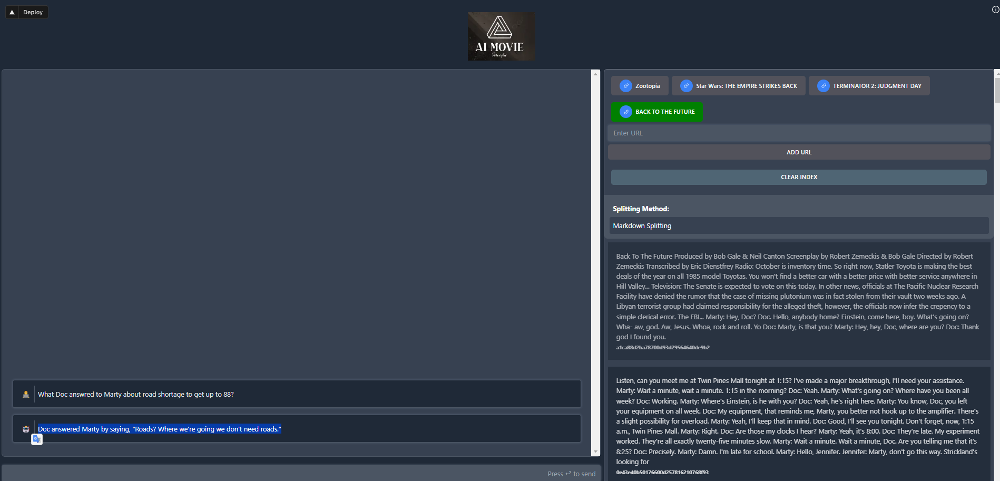

## Overview

This is the final project of the Encode AI Bootcamp,  It is a web application designed to provide users utilitiy to get the knowldge from movies.  They can query to the chat to clarify the events in the movie. 

## Motivation

The motivation of this chatbot is porvide functionaliy for people who forgot what exactly happened in particular movie by using a movie screenplay. Also I want  to practice  learned  skills acquired at a bootcamp.

## Technologies

-  Next.js vy vertex.ai
-  OpenAI models: GPT-3.5, text-embedding-3-small.
-  Pinecone: vector database to build knowledgeable AI (RAG)

## Reproducibility


```bash
git clone https://github.com/Nogromi/ai_movie.git
```

Sign up to [PINECONE](https://www.pinecone.io/)

1. Install dependencies

```
npm install
```

2. Create `.env` file

```
cp .env.example .env
```

3. Add your OpenAI API key, PINECONE credentials to a `.env` file

```
OPENAI_API_KEY=your-api-key-here
PINECONE_API_KEY=your-PINECONE_API_KEY-key-here
PINECONE_CLOUD=your-PINECONE_CLOUD-key-here
PINECONE_REGION=your-PINECONE_REGION-key-here

PINECONE_INDEX=your-PINECONE_INDEX-key-here
```

4. Start the development server

```
npm run dev
```

Navigate to  [http://localhost:3000](http://localhost:3000) with your browser to see the result.

## The interface

1. On the right side you can see the bunch of preloaded movie screenplay:

- Zootopia

- Star Wars: THE EMPIRE STRIKES BACK

- TERMINATOR 2: JUDGMENT DAY

- BACK TO THE FUTURE

## Demo

Press the desired movie to get the screenplay. IT will load it and you can see new cars on the right side with its docs. 

Write a query in the right botthom form corresponding to the movie. For example 

```
What Doc answred to Marty about road shortage to get up to 88?
```




Doc answered Marty by saying, "Roads? Where we're going we don't need roads."


## TODOs
- impelement manual screenplay  addition to the store 
- add youtube videos transcript by video url